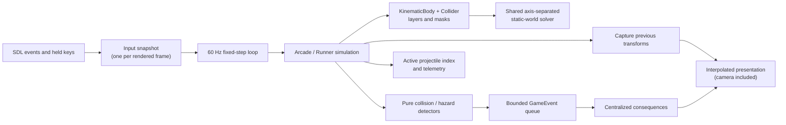

# Ucode_Endgame


Ucode IT Academy C Marathon: Final team project (Serha/Slipchencko team).

## Build and run

### macOS

The original primary build uses the bundled SDL frameworks:

```sh
make
./endgame
```

### Windows / MinGW

The additive Windows build needs MinGW-w64 GCC, GNU Make, and Python 3 (for the standard-library-only DLL copy helper). Install the toolchain, then fetch the pinned SDL2 MinGW development packages:

```sh
./scripts/setup-mingw-sdl2.sh
make mingw
make mingw-run
```

`make mingw` copies the four required SDL DLLs with `scripts/copy_mingw_dlls.py` and `shutil.copy2()`. The target works from PowerShell, CMD, MSYS2, and Linux; on native Windows it selects `py -3`, while other environments use `python3`. Override `PYTHON` if your Python command differs.

### Focused validation targets

The repository has 27 focused MinGW checks, plus `audit-repo`:

```sh
make mingw-smoketest             # init, asset guard, shutdown
make mingw-scenetest             # scene transitions
make mingw-lifecycletest         # assets and session reset
make mingw-frametest             # frame order, render purity, animation
make mingw-deathtest             # Runner death and respawn lifecycle
make mingw-entityspawntest       # enemy/boss factories
make mingw-commandtest           # input command translation
make mingw-headertest            # standalone public headers
make mingw-groupingtest          # GameState nested-struct lifecycle
make mingw-physicstest           # fixed-timestep player physics
make mingw-inputtest             # jump buffering and input state
make mingw-collisiontest         # player/ledge collision correctness
make mingw-projectiletest        # projectile pool, sweep, movement
make mingw-gamefeeltest          # coyote time, jump buffer, variable height
make mingw-inputsnapshottest     # frame input snapshot isolation
make mingw-aiforcestest          # boss/enemy/smart-enemy forces
make mingw-collisionorderingtest # collision ordering and event consequences
make mingw-interpolationtest     # render interpolation is presentation-only
make mingw-physicsunitstest      # remaining per-second movement units
make mingw-physicsbodytest       # shared body/collider model
make mingw-worldcollisiontest    # common static-world solver
make mingw-displaytest           # display defaults and persisted-size bounds
make mingw-settingstest          # settings defaults, rebinding, and reset
make mingw-replaytest            # deterministic seed/input simulation replay
make mingw-wavetest              # data-driven Arcade wave progression
make mingw-segmenttest           # authored Runner segments and streaming
make mingw-feedbacktest          # combat effects, hit-stop, and animation clocks
make audit-repo                   # resource-path and prototype integrity
```

`make mingw-asan` is retained for a sanitizer-capable toolchain, but the MinGW-w64 distributions used here do not ship the needed ASan/UBSan runtime libraries. `vendor/` and `build-mingw/` are generated, gitignored directories.

Set `ENDGAME_PERF_LOG=1` before running `endgame-mingw.exe` or `make mingw-run` to emit a once-per-second summary such as `[perf] ticks=60 physics_ms=... render_ms=... active_projectiles=... projectile_checks=...`.

### Linux

`make linux` and `make linux-smoketest` build the production sources against system SDL2 development packages discovered through `pkg-config`. `make linux-asan` runs the deterministic replay test under AddressSanitizer and UndefinedBehaviorSanitizer. This path is validated in CI and is not a replacement for the original macOS build.

## Continuous integration

`.github/workflows/mingw-validation.yml` runs the Windows/MinGW build, all 27 focused checks, and repository integrity audit for pull requests and pushes to `main`. Its Linux jobs validate asset-path case, perform a best-effort Linux build/smoke test, and run a required deterministic replay ASan/UBSan check.

## Asset ownership

Textures and audio load before their corresponding mode is playable. Shared
menu/UI audio is initialized with the application; Arcade and Runner music and
effects are loaded by their mode asset groups. Gameplay only plays these
preloaded assets, preventing first-use I/O during simulation.

## Architecture (Phase 26)

Simulation is fixed at 60 Hz (`PHYSICS_HZ` / `PHYSICS_DT`); real-frame input is captured once, simulation can run zero or more fixed steps, and rendering interpolates between captured previous and current transforms. Player movement, bullets, enemies, bosses, scrolling, traps, and Runner's multiplayer camera use explicit time-based units. The bullet speed constant is `BULLET_SPEED_PER_SEC`, preserving the previous observable speed at 60 Hz without encoding a per-tick unit in its name. Phase 28 keeps these gameplay coordinates at `1280×720` while SDL letterboxes aspect-ratio-preserving logical rendering to a resizable high-DPI window.



Key supporting records:

- `docs/physics-timestep-map.md` explains fixed-step simulation and per-second units.
- `docs/input-snapshot-architecture-map.md` and `docs/ai-forces-separation-map.md` document input isolation and the extracted AI/force layer.
- `docs/collision-ordering-map.md` records the Phase 24 event-consequence architecture; `docs/phase25-profile-guided-optimization.md` records active projectile indexing and telemetry.
- The Phase 20–24 focused verification sources (`docs/verification/render_interpolation_test.c`, `physics_body_test.c`, `world_collision_test.c`, and `collision_pipeline_test.c`) lock in interpolation, bodies/colliders, the world solver, and event consequences.

## Supported-platform status (Phase 26, 2026-07-22)

| Platform | Build | Verification | Runtime validation |
|---|---|---|---|
| Windows / MinGW | Local and CI `make mingw`; portable Python DLL copy | 27 focused checks + audit in CI | Headless runtime checks |
| macOS (bundled frameworks) | Original `make` target | Not run in this environment | Not runtime-validated here |
| Linux | `make linux-asan` and best-effort `make linux` | Case-sensitive asset audit + required replay ASan/UBSan + best-effort smoke test | Sanitized simulation coverage |

Asset-path casing fixes are documented in `docs/asset-path-portability.md`. AddressSanitizer/UndefinedBehaviorSanitizer are unavailable in the validated MinGW toolchains; use a sanitizer-capable Linux or MSVC/clang-cl environment for sanitizer builds.

## Manual

The game has two modes:

1. Arcade battle mode: defeat enemies before they reach Unit City. If enemies reach the city or touch you, you lose a life.
2. Runner mode: run right as long as possible. Falling or touching a trap costs one of three lives; a brief death animation plays before respawn, and the game ends after all lives are gone.

Each mode has local multiplayer using one keyboard.

### Main menu

1. Press `1`, `2`, or `3` to choose a mode.
2. Press `S` to open Settings.
3. Press `Esc` to exit the main menu or return from the second menu.
4. Press `Q` to leave the second menu or any in-game window.

### Controls

- `P`: pause.
- `Esc`: leave pause or return to a menu without saving.
- `F11`: toggle fullscreen; the most recent windowed size and fullscreen mode are persisted in SDL's user preference directory.
- Settings: Up/Down selects, Left/Right adjusts, Enter rebinds a selected player action or resets defaults, and Esc returns to the main menu. Music/effects volumes, VSync, screen-shake preference, and key bindings are persisted in SDL's user preference directory.
- Player 1 defaults: `W`, `A`, `D` move/jump; `Space` shoots. These keys are remappable in Settings.
- Player 2 defaults: arrow keys move/jump; keypad `0` shoots. These keys are remappable in Settings.
- Controller Player 1: D-pad or left stick moves, `A` jumps, `X` shoots in Arcade. Keyboard and controller input can be used together.

Good luck; have fun.
